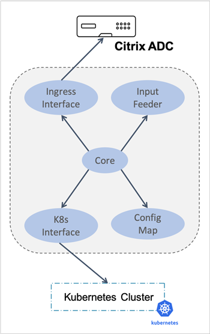

[](https://travis-ci.com/janraj/citrix-k8s-node-controller) [](https://codecov.io/gh/janraj/citrix-k8s-node-controller) [](./license/LICENSE) [](https://goreportcard.com/report/github.com/janraj/citrix-k8s-node-controller) [](https://quay.io/repository/citrix/citrix-k8s-node-controller)

# **Citrix-k8s-node-controller**
Citrix Node Controller (CNC) is a micro service which creates the network between cluster and ingress device.  Citrix node controller can run inside the cluster as a pod or outside the cluster. In case of outside the cluster, it requires a proper Kube config file to run successfully. <span style="color:red">**Citrix Node Controller currently works only with flannel as CNI. The scope of Citrix node controller can be extended to other CNI.**</span>

## **Description**
When services on Kubernetes expose to external access via the Ingress device, there has to be proper networking between the Kubernetes nodes and ingress device to route the traffic into the cluster.   This is important because the pods will be having private IP’s based on the CNI framework.  These Private IP’s will not be able to directly access from ingress device without proper network configurations. Manual configuration to ensure such reachability is troublesome in Kubernetes world.

## **Architecture**
This is the high-level preview of Citrix node controller architecture. Following are the main components.	



       <details>
       <summary>**Ingress Interface**</summary>
	    Ingress Interface is responsible for interacting with Citrix ADC via nitro rest API. It maintains the nitro session and invokes it when required. 
       </details>
       <details>
       <summary>**K8s Interface**</summary>
	    This module interacts with Kube API server via K8s Go Client. It ensures the availability of client and maintains a healthy client session.
       </details>
       <details>
       <summary>**Node Watcher**</summary>
	    The node watcher unit is used to watch the node events via K8s Interface. It responds to the node events such as node addition, deletion or modification with its call            back functions.
       </details>
       <details>
       <summary>**Input Feeder**</summary>
	    It provides inputs to the config decider. Some of the inputs are auto detect and the rest are taken from the CNC deployment yaml. 
       </details>
       <details>
       <summary>**Config Decider**</summary>
	    This segment takes inputs from both the node watcher and the input feeder and decides the best network automation required between cluster and NetScaler.
       </details>
       <details>
       <summary>**Core**</summary>
	    The core module interacts with node watcher and updates the corresponding config engine.  It is responsible for starting the best config engine for the corresponding             cluster.
       </details>

## **Questions**
For questions and support the following channels are available:
* [Citrix Discussion Forum](https://discussions.citrix.com/forum/1657-netscaler-cpx/). 
* [NetScaler Slack Channel](https://citrixadccloudnative.slack.com/)

## **Issues**
Describe the Issue in Details, Collects the logs and  Use the forum mentioned below
```
   https://discussions.citrix.com/forum/1657-netscaler-cpx/
```

## **Code of Conduct**
This project adheres to the [Kubernetes Community Code of Conduct](https://github.com/kubernetes/community/blob/master/code-of-conduct.md). By participating in this project you agree to abide by its terms.

## **License**
[Apache License 2.0](./license/LICENSE)
